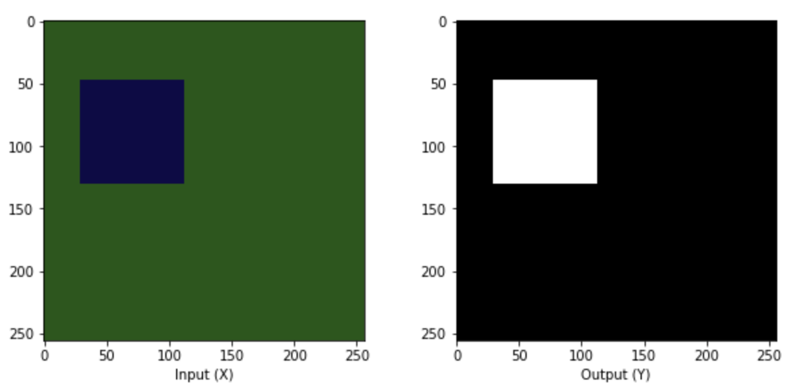

<div align="center">
    <h1>TF-Unet</h1>
    
    <p>General purpose U-Network implemented in Keras for image segmentation</p>
    <p>
        <a href="#getting-started">Getting started</a> •
        <a href="#training">Training</a> •
        <a href="#evaluation">Evaluation</a> •
        <a href="#contributing">Contributing</a>
    </p>
    
    
</div>

## Getting started
Looking for Jupyter notebooks? checkout the [training](https://github.com/juniorxsound/TF-Unet/blob/master/notebooks/Training.ipynb), [evaulation](https://github.com/juniorxsound/TF-Unet/blob/master/notebooks/Evaluation.ipynb) and [prediction](https://github.com/juniorxsound/TF-Unet/blob/master/notebooks/Prediction.ipynb) notebooks or run `make jupyter` to serve them locally.

### Dependencies
To quickly get started make sure you have the following dependencies installed:
- [Docker (19 or newer)](https://docs.docker.com/install/) 📦
- [Make](https://www.gnu.org/software/make/) *[Optional macOS / Linux]* 🛠
- [Nvidia Container Toolkit](https://github.com/NVIDIA/nvidia-docker#quickstart) *[Optional for GPUs]* 🗜
</ul>

### Setup
Clone (or [download](https://github.com/juniorxsound/TF-Unet/archive/master.zip)) the repository and `cd` into it
```sh
git clone https://github.com/juniorxsound/TF-Unet.git && cd TF-Unet
```
Next build the Docker image by simply running `make build`
> The build process will pick either `Dockerfile.cpu` or `Dockerfile.gpu` based on your system

## Training
This repository uses the `ShapeDataset` synthetic data generator written by Matterport (in [Mask R-CNN](https://github.com/matterport/Mask_RCNN/blob/master/samples/shapes/train_shapes.ipynb)). No download is needed, as all data is generated during runtime, here is a sample of the dataset


To start training, simply call `make train` which will start the training process using the [parameters defined in `train.py`](https://github.com/juniorxsound/TF-Unet/blob/master/train.py#L13-L16). A model will be saved at the end of the training process into the weights folder in [`SavedModel` format](https://www.tensorflow.org/guide/saved_model).

If you are interested in following the training process, you can use `make log` during training to start a Tensorboard server with accuracy and loss metrics being updated every batch. 
> Tensorboard image here

If you want to train in a Jupyter notebook follow the [Training notebook](https://github.com/juniorxsound/TF-Unet/blob/master/notebooks/Training.ipynb)

## Evaluation
To run evaluation simply use `make evaluate` or the Jupyter [Evaluation notebook](https://github.com/juniorxsound/TF-Unet/blob/master/notebooks/Evaluation.ipynb)

## Prediction
See the Jupyter [Prediction notebook](https://github.com/juniorxsound/TF-Unet/blob/master/notebooks/Prediction.ipynb)

## Architecture
The implementation was inspired by [U-Net: Convolutional Networks for Biomedical Image Segmentation](https://lmb.informatik.uni-freiburg.de/people/ronneber/u-net/)


## Thanks to
The [original paper authors](https://arxiv.org/abs/1505.04597), this [Keras UNet implementation](https://github.com/zhixuhao/unet), this [Tensorflow UNet implementation](https://github.com/jakeret/tf_unet) and [Mask R-CNN authors](https://github.com/matterport/Mask_RCNN).